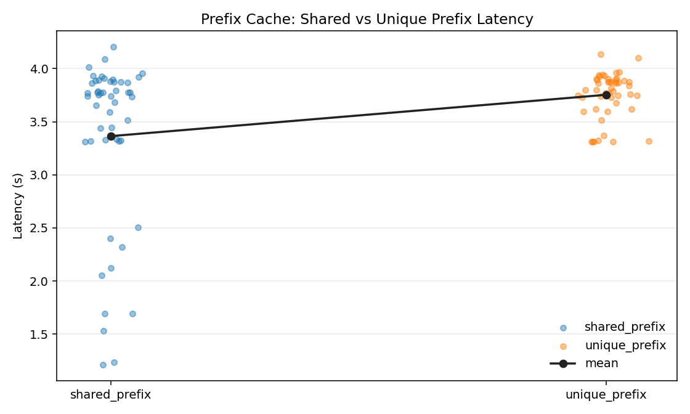
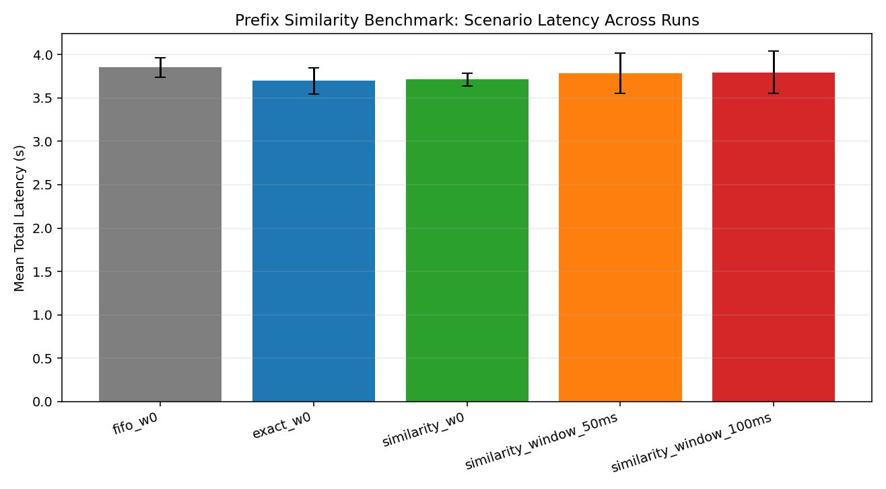
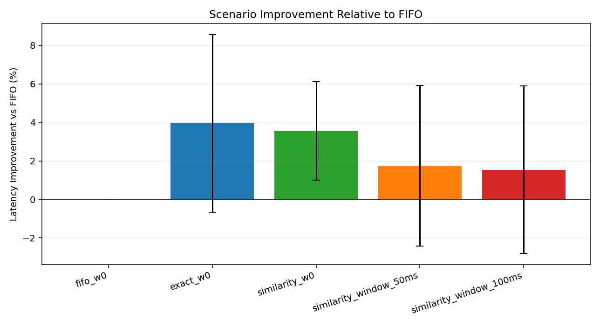
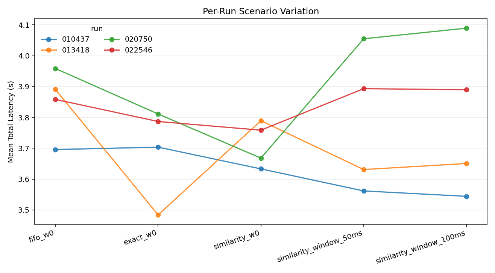
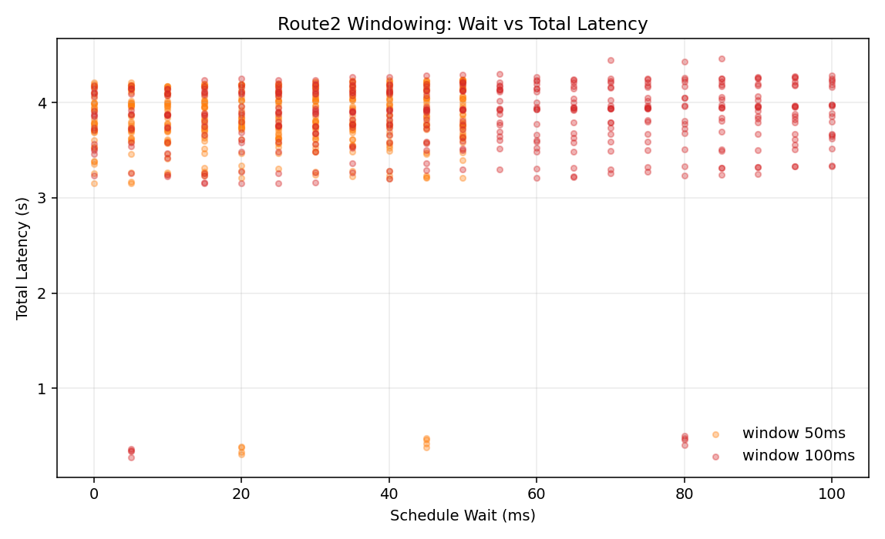
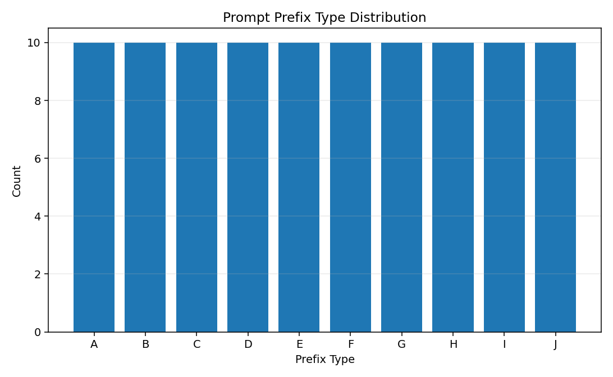

# Prefix-Aware KV Cache 

## 1. 实验方法说明

### 1.1 实验目标
本实验围绕 vLLM 推理中的前缀复用能力，验证两类问题：

1. 共享前缀是否显著降低请求时延（prefix cache 基准实验）。
2. 在存在“相似但不完全相同”前缀时，prefix-aware 调度（分组/窗口）是否可进一步改善总体时延。

### 1.2 Prefix-Aware 方法设计

本项目在脚本层实现了两条主线：

1. **共享前缀对照实验**（`scripts/prefix_cache_benchmark.py`）
- `shared_prefix`：请求共享前缀模板。
- `unique_prefix`：请求前缀基本唯一。
- 对两组请求统计 mean/p50/p90 latency、吞吐等指标。

2. **相似前缀实验**（`scripts/prefix_similarity_window_benchmark.py`）
- **Route1（立即调度）**
  - `fifo_w0`：不分组，按原始顺序。
  - `exact_w0`：按固定前缀片段（前 120 字符）精确分组。
  - `similarity_w0`：按前缀 token 的 SimHash 相似分组（阈值 8 bits）。
- **Route2（窗口调度）**
  - `similarity_window_50ms`
  - `similarity_window_100ms`
- 核心思路是：通过重排请求顺序，让相同/相似前缀尽量邻近，增加 KV cache 命中与可复用前缀 token。

### 1.3 数据与运行设置

1. 数据集
- `vllm_shared_prefix_prompts_100.json`：用于 shared vs unique 对照。
  - 实际数据：shared=50，unique=51，实验各取 50 条。
- `vllm_shared_prefix_10types_100.json`：用于相似前缀实验。
  - 100 条样本，prefix_type A~J 各 10 条。

2. 主要运行配置（来自 `data/prefix_cache_meta_20260331_231102.json` 与 4 份 `prefix_similarity_meta_*.json`）
- 模型：`Qwen/Qwen2.5-3B-Instruct`
- `max_tokens=128`，`temperature=0.0`
- 相似前缀参数：`sim_prefix_tokens=24`，`sim_threshold_bits=8`
- 窗口参数：`window_ms_list=50,100`，`arrival_gap_ms=5`
- 相似前缀实验共 4 轮（`20260401_010437`、`013418`、`020750`、`022546`）

### 1.4 结果产出与可复现脚本

新增脚本：`scripts/generate_report_assets.py`

作用：
- 自动读取 `data/` 下实验结果。
- 生成汇总表：
  - `data/report_cache_group_stats.csv`
  - `data/report_similarity_scenario_aggregate.csv`
  - `data/report_window_wait_stats.csv`
  - `data/report_prompt_prefix_type_counts.csv`
- 生成图表：
  - `plots/report_cache_shared_vs_unique_latency.png`
  - `plots/report_similarity_scenario_mean_latency.png`
  - `plots/report_similarity_run_variation.png`
  - `plots/report_similarity_improve_vs_fifo.png`
  - `plots/report_window_wait_vs_total_latency.png`
  - `plots/report_prompt_prefix_type_counts.png`

---

## 2. 实验结果说明

### 2.1 Shared vs Unique Prefix（单次 50+50 请求）

来源：`data/report_cache_group_stats.csv`

| mode | count | latency_mean_s | latency_p50_s | latency_p90_s | throughput_tokens_per_s_mean | output_tokens_mean |
|---|---:|---:|---:|---:|---:|---:|
| shared_prefix | 50 | 3.365 | 3.747 | 3.930 | 34.119 | 114.74 |
| unique_prefix | 50 | 3.754 | 3.801 | 3.940 | 34.210 | 128.00 |

关键结论：
- 平均时延从 3.754s 降到 3.365s，约降低 **10.37%**。
- 以 unique/shared 计算，均值 speedup 约 **1.116x**。

### 2.2 Prefix Similarity 多场景结果（4 轮聚合）

来源：`data/report_similarity_scenario_aggregate.csv`

| scenario | runs | latency_mean_avg_s | latency_mean_std_s | latency_p90_avg_s | throughput_avg | reuse_ratio_avg | improve_vs_fifo_pct_avg |
|---|---:|---:|---:|---:|---:|---:|---:|
| fifo_w0 | 4 | 3.851 | 0.112 | 4.127 | 32.787 | 0.000 | 0.000 |
| exact_w0 | 4 | 3.696 | 0.149 | 3.972 | 34.024 | 0.358 | 3.960 |
| similarity_w0 | 4 | 3.712 | 0.074 | 3.982 | 33.821 | 0.389 | 3.559 |
| similarity_window_50ms | 4 | 3.785 | 0.230 | 4.047 | 33.187 | 0.389 | 1.746 |
| similarity_window_100ms | 4 | 3.794 | 0.245 | 4.058 | 33.162 | 0.389 | 1.543 |

### 2.3 窗口等待代价（Route2）

来源：`data/report_window_wait_stats.csv`

| window_ms | count | schedule_wait_ms_mean | model_latency_s_mean | total_latency_s_mean |
|---:|---:|---:|---:|---:|
| 50 | 400 | 25.25 | 3.760 | 3.785 |
| 100 | 400 | 52.00 | 3.742 | 3.794 |

可见 100ms 窗口虽然略降低模型执行时延（3.742 < 3.760），但额外排队等待更大，导致总时延反而略高。

### 2.4 数据分布（prefix_type）

来源：`data/report_prompt_prefix_type_counts.csv`

| prefix_type | count |
|---|---:|
| A | 10 |
| B | 10 |
| C | 10 |
| D | 10 |
| E | 10 |
| F | 10 |
| G | 10 |
| H | 10 |
| I | 10 |
| J | 10 |

---

## 3. 实验结果分析

### 3.1 Prefix-Aware 的有效性

1. **共享前缀收益明确**
- shared_prefix 对比 unique_prefix，平均时延降低约 10.37%，说明 KV cache 复用对 prefill 成本有可观收益。

2. **分组策略普遍优于 FIFO**
- 在 4 轮平均上，`exact_w0` 和 `similarity_w0` 都优于 `fifo_w0`（约 3.56%~3.96%）。
- 说明即使不引入窗口，仅做请求重排也能改善性能。

3. **相似分组的复用率更高，但不必然带来更低端到端时延**
- `similarity_w0` 的平均复用率（0.389）高于 `exact_w0`（0.358），但 mean latency 略高于 exact。
- 可能原因：相似分组带来的重排结构与模型执行路径并不总能转化为更低 wall-clock latency（受并发/批调度细节影响）。

### 3.2 窗口调度的权衡

1. 窗口变大增加等待开销：50ms -> 100ms 时，平均等待从 25.25ms 增至 52.00ms。
2. 窗口对模型执行时延有轻微正向影响，但不足以抵消排队时间。
3. 最终在当前负载下，窗口方案相较 `similarity_w0` 并未取得更好总时延。

### 3.3 结果稳定性与不确定性

1. 4 轮实验中，`exact_w0` 与 `similarity_w0` 的标准差较小于窗口场景，稳定性更好。
2. 元数据显示不同轮次并发设置存在差异（如 3/5/10），这会引入额外波动。
3. 因此当前结论可视为“趋势成立”，但仍建议在固定并发、固定服务状态下做更长轮次复验。

---

## 4. 展望

1. **自适应窗口策略**
- 将固定窗口（50/100ms）升级为自适应窗口，根据实时队列长度、GPU 利用率、尾延迟预算动态调整。

2. **分组与调度联合优化**
- 结合“prefix 相似度 + 请求长度 + 预估 decode 成本”进行联合排序，避免仅以前缀相似度为唯一准则。

3. **在线 A/B 验证**
- 在真实流量中对比 FIFO、exact、similarity 三策略，关注 P95/P99、吞吐和失败率，而不仅是均值。

4. **更细粒度缓存度量**
- 增加命中层级、命中时长、KV eviction 原因等观测字段，定位复用率与时延收益不一致的根因。

5. **跨模型/跨负载泛化**
- 在不同模型规模、不同输入输出长度分布下复验，以评估 prefix-aware 策略的泛化边界。
